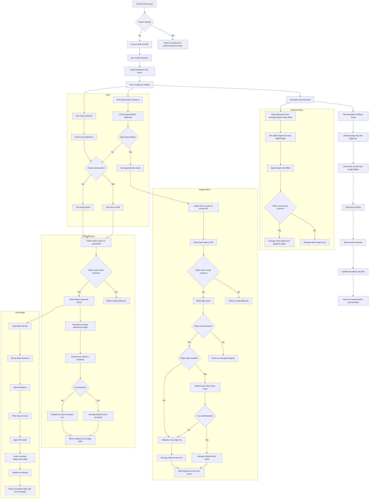
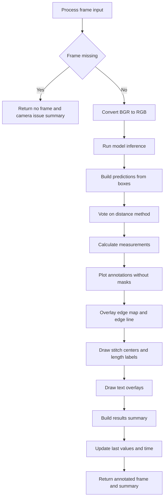
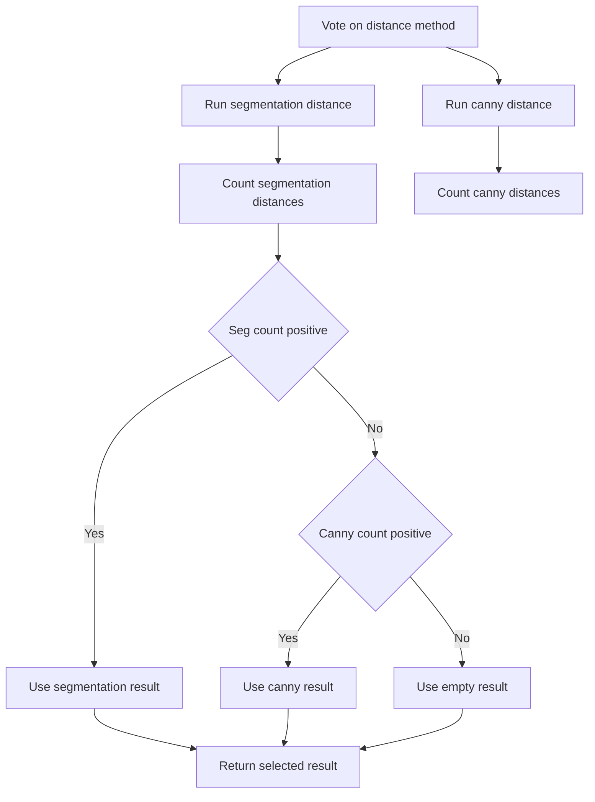
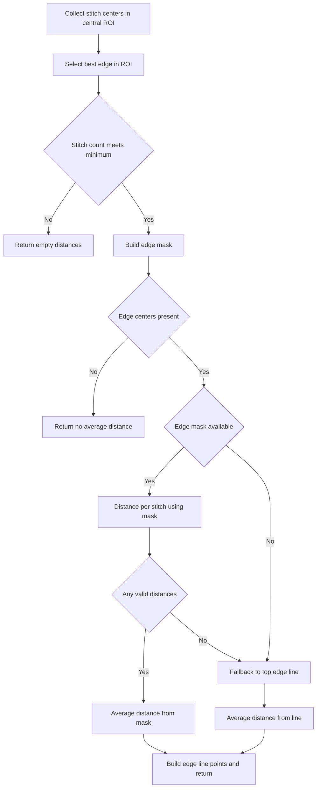
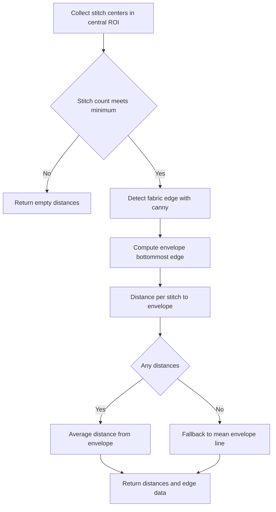
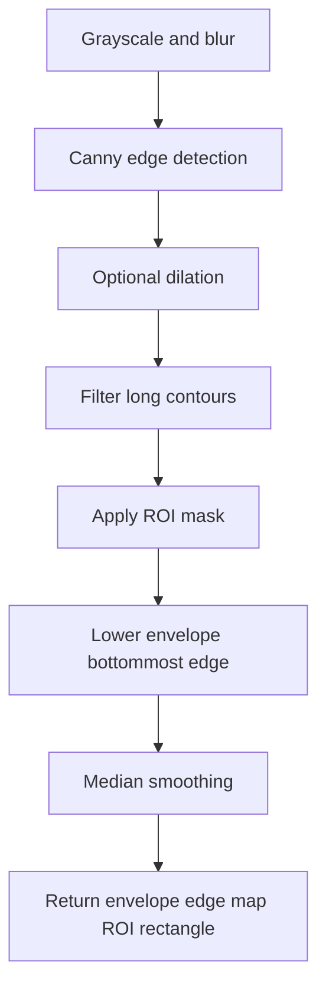

# Image Processor Flow

This document explains the processing flow implemented in image_processor.py and provides detailed flow charts for the main frame pipeline and the stitch-to-edge distance logic.

## Overview

The ImageProcessor class performs these jobs for each camera frame:

- Run YOLO inference to detect stitches and edges.
- Compute stitch length and seam allowance (stitch-to-edge distance).
- Choose the best edge distance source (YOLO segmentation first, Canny fallback).
- Overlay measurements and edge visuals on the output frame.
- Export results for display and for the database thread.

Key data and configuration inputs:

- mm_per_pixel from calibration (pixel to mm conversion).
- Thresholds and offsets from config (min detections, offsets, ideal ranges).
- ROI filtering: only the central 50 percent of the frame is used for stitch/edge centers.

## Full End-to-End Flowchart

## Main Frame Processing Flow

## Distance Vote (Segmentation vs Canny)

## YOLO Segmentation Distance Flow

## Canny Envelope Distance Flow

## Canny Edge Detection Flow

## Measurement Details (Text Summary)

- Seam allowance is derived from avg_distance_mm + config.SEAM_ALLOWANCE_OFFSET_MM.
- Stitch length is computed from each stitch box using max(width, height), then adjusted by config.STITCH_LENGTH_OFFSET_MM.
- If the number of valid stitches is below MIN_STITCH_DETECTIONS, average stitch length is set to None.
- If seam allowance or stitch length is outside the ideal range, the code logs an info message (range checks still rely on a later override decision).
