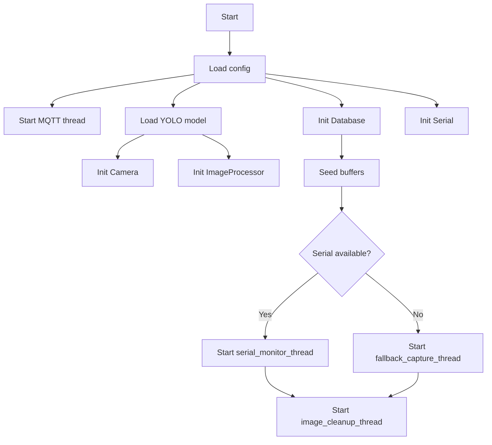
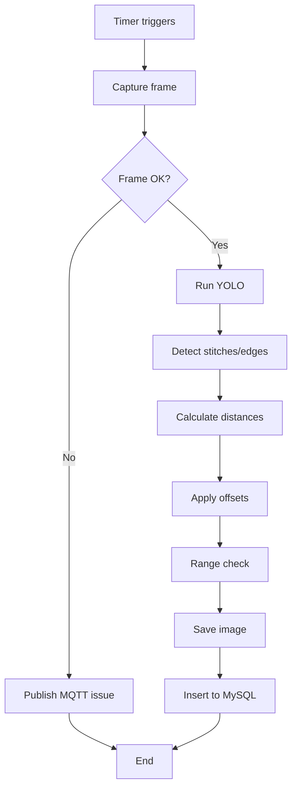
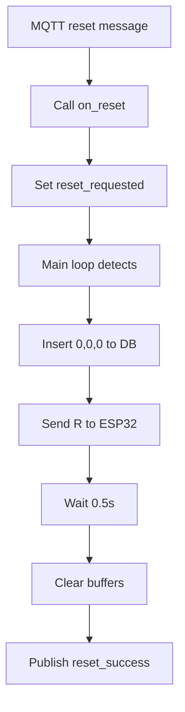
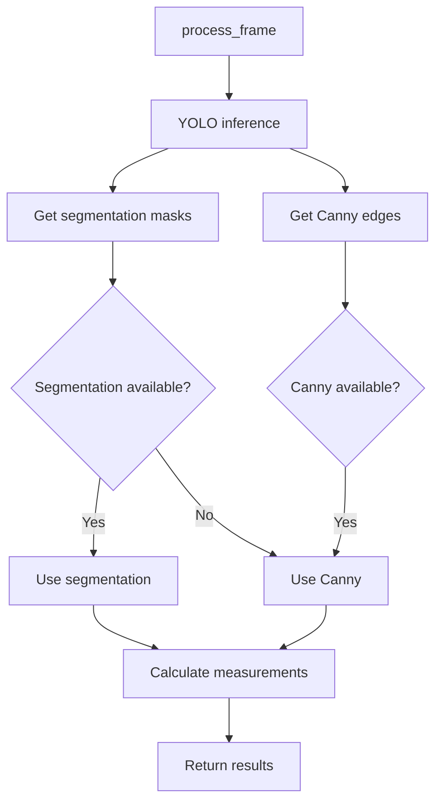
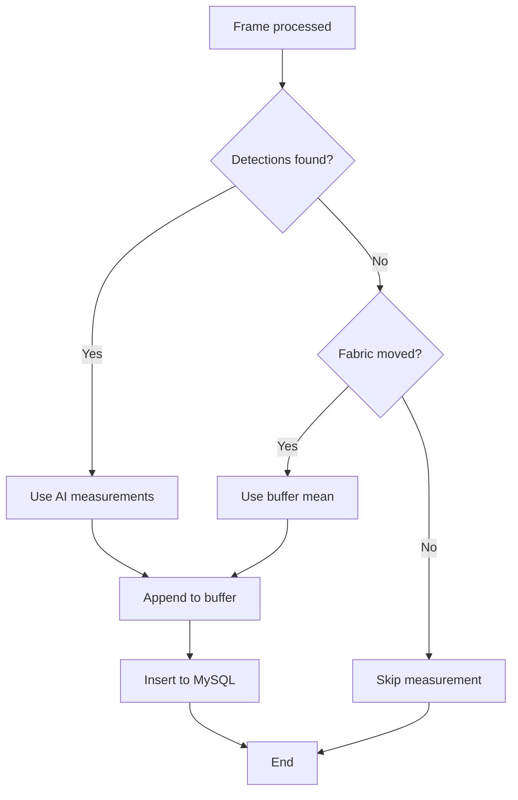
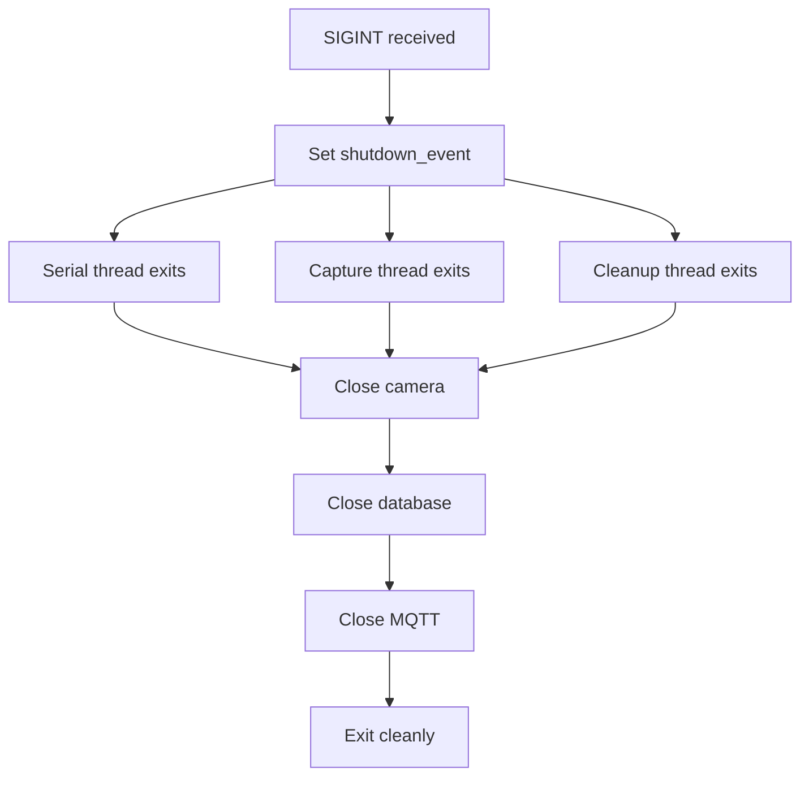

# THREAD — Fabric Inspection System (Complete Overview)

## Table of Contents
1. [Project Purpose & High-Level Architecture](#project-purpose--high-level-architecture)
2. [System Components](#system-components)
3. [Runtime Flow & Flowcharts](#runtime-flow--flowcharts)
4. [Configuration](#configuration)
5. [Dependencies](#dependencies)
6. [Setup & Deployment](#setup--deployment)
7. [Data Flow Diagrams](#data-flow-diagrams)

---

## Project Purpose & High-Level Architecture

### Overview
**THREAD** is a real-time fabric inspection system that uses AI (YOLO-based object detection) and computer vision to measure stitch quality and seam allowance on sewing machines. The system:

- Captures frames from a USB camera at regular intervals (configurable via `CAPTURE_INTERVAL`)
- Detects stitches and fabric edges using a trained YOLO model
- Measures average stitch length (mm) and seam allowance (distance from stitch to fabric edge)
- Tracks cumulative fabric movement distance (via ESP32 serial input)
- Stores measurements in MySQL for real-time monitoring and historical analysis
- Publishes heartbeat status and camera issues via MQTT
- Supports graceful reset via MQTT commands
- Automatically cleans up old images based on retention policy

### Why This Architecture?
- **Modular design**: Each component (camera, image processing, database, serial, MQTT) is independent and testable.
- **Thread-based concurrency**: Serial monitoring and capture scheduling run in background threads; main loop handles MQTT resets.
- **Fallback mechanisms**: If serial port fails, timer-based fallback capture keeps the system running.
- **Real-time DB**: Every processed frame inserts immediately (no queuing), ensuring data freshness.
- **Buffered fallbacks**: Last 5 valid measurements are kept in memory as fallback when AI detections are unavailable.

---

## System Components

### 1. **main.py** — Orchestrator & Entry Point
**Responsibility**: Initialize all modules, start worker threads, coordinate lifecycle.

**Key Functions**:
- `main()` — Initialization, thread startup, main loop with reset handling
- `process_fabric_immediate()` — Core processing pipeline (per-frame)
- `serial_monitor_thread()` — Reads stitch counts and triggers processing
- `fallback_capture_thread()` — Timer-based trigger when serial unavailable
- `perform_reset()` — Handles MQTT reset commands
- `reload_camera()` — Reloads uvcvideo driver if camera fails

**Global State**:
- `shutdown_event` — Threading event for graceful shutdown
- `processing_lock` — Prevents overlapping capture/process
- `stitch_length_buffer`, `seam_allowance_buffer` — Fallback measurement history

---

### 2. **camera_manager.py** — Hardware Camera Interface
**Responsibility**: Open, configure, and safely capture frames from USB camera.

**Key Methods**:
- `init_camera()` — Auto-discovers camera via `find_camera()`, sets resolution and buffer size
- `capture_frame_safely()` — Flushes buffer (reads 3 dummy frames), returns latest clean frame
- `_handle_reconnect_failure()` — Tracks reconnect attempts; triggers driver reload if max exceeded
- `reinit_camera()` — Gracefully closes and reopens camera device

**Features**:
- Auto-discovery of `/dev/video0` (or user-configured index)
- Configurable frame resolution (default 1280x960)
- Automatic driver reload (modprobe uvcvideo) on persistent failure
- Graceful degradation: system continues if camera is unavailable

---

### 3. **image_processor.py** — AI Inference & Measurements
**Responsibility**: Run YOLO inference, detect stitches/edges, calculate metrics.

**Key Methods**:
- `process_frame(frame, current_total_distance)` — Main entry point; returns (annotated_image, summary, result)
- `calculate_stitch_edge_distances()` — Uses YOLO segmentation masks to measure stitch-to-edge distance
- `calculate_stitch_edge_distances_canny()` — Fallback using Canny edge detection + envelope tracing
- `calculate_stitch_edge_distances_vote()` — Voting system: prefers segmentation, falls back to Canny
- `calculate_measurements()` — Extracts stitch lengths from detection boxes, applies offsets & range filtering
- `detect_fabric_edge_canny()` — Canny-based fabric boundary detection

**Measurement Pipeline**:
1. YOLO inference on frame → boxes, masks, classes, confidence
2. Extract stitch/edge centers from high-confidence detections
3. Filter to central ROI (25–75% of image) to avoid corner artifacts
4. Compute perpendicular distances from stitch centers to edge line/mask
5. Apply pixel-to-mm conversion (from calibration or config)
6. Apply offsets (`STITCH_LENGTH_OFFSET_MM`, `SEAM_ALLOWANCE_OFFSET_MM`)
7. Filter by ideal ranges; log warnings for out-of-range values
8. Return average values (or None if insufficient valid detections)

**Calibration**:
- Loads camera intrinsics (K, distortion) and extrinsics (R, t) from JSON files
- Calculates mm-per-pixel at image center via ray-plane intersection
- Falls back to config value if calibration files missing

---

### 4. **database_manager.py** — MySQL Persistence
**Responsibility**: Connect to MySQL, insert measurements, retrieve history for fallbacks.

**Key Methods**:
- `connect()` — Establishes/reuses MySQL connection
- `insert_measurement(stitch_length, seam_allowance, total_distance, ignore_limits=False)` — Inserts row; skips if values missing or out-of-range (unless force insert for reset)
- `reset_total_distance_on_startup()` — Inserts reset row (0,0,0) at day boundary
- `get_last_measurement_date()` — Returns timestamp of last row (for day-boundary check)
- `get_last_total_distance()` — Retrieves most recent total_distance for session initialization
- `get_recent_valid_measurements(limit=5)` — Returns last N valid rows for seeding fallback buffers

**Table Schema**:
```
timestamp DATETIME(3)       — millisecond precision
stitch_length FLOAT/DECIMAL — mm
seam_allowance FLOAT/DECIMAL — mm
total_distance FLOAT/DECIMAL — mm
```

**Insertion Behavior**:
- Skips insert if `stitch_length` or `seam_allowance` is None (real measurement required)
- Skips if out of ideal ranges (unless `ignore_limits=True`)
- Always includes `timestamp` (NOW()) for auditing

---

### 5. **serial_communicator.py** — ESP32 Serial Interface
**Responsibility**: Read stitch count from ESP32, compute distance, send reset commands.

**Key Methods**:
- `_open_serial_port()` — Opens configured port (or auto-discovers ESP32 via USB VID/PID)
- `read_serial_data()` — Non-blocking read; parses integer stitch count from incoming lines
- `update_distance_from_stitch_count(delta)` — Increments `current_total_distance` by `delta * last_avg_stitch_length_mm`
- `send_command(cmd)` — Writes string command to serial (e.g., "R" for reset)

**Key Attributes**:
- `current_total_distance` — Running total fabric distance (mm); initialized from DB, incremented per stitch delta
- `last_avg_stitch_length_mm` — Latest valid AI measurement; used to convert stitch deltas to mm

**Features**:
- Rate-limited reconnect attempts (max every 2s)
- Anti-spam logging to avoid console spam during serial unavailability
- Thread-safe with `_serial_lock`

---

### 6. **mqtt_heartbeat.py** — Status & Reset Commands
**Responsibility**: Publish heartbeat, subscribe to reset topic, trigger reset callback.

**Key Methods**:
- `run()` — Connects to MQTT broker, publishes heartbeat every interval, runs listener loop
- `_on_message()` — Callback when reset message ("reset") received on reset_topic
- `publish_reset_success()` — Acknowledges successful reset

**Topics**:
- `machine/{DEVICE_ID}/status/heartbeat` — Publishes "on" periodically (default 2.0s)
- `machine/{DEVICE_ID}/commands/reset` — Subscribes; "reset" triggers callback
- `machine/{DEVICE_ID}/status/camera_issue` — Published when frame capture fails

**Features**:
- TLS support (configurable certificate validation)
- Automatic reconnect (1–10s backoff)
- Daemon thread (doesn't block shutdown)

---

### 7. **cleanup.py** — Image Retention & Cleanup
**Responsibility**: Periodically delete images older than retention period.

**Key Function**:
- `image_cleanup_thread(shutdown_event, active_session_dir)` — Walks output directory, deletes .jpg older than `IMAGE_RETENTION_SECONDS`, removes empty folders

**Features**:
- Excludes active session from deletion (prevents mid-run data loss)
- Recursive cleanup (searches subdirectories)
- Bottom-up folder removal (cleans empty dirs after files)
- Runs every `CLEANUP_INTERVAL` (default 1 hour)

---

### 8. **calibration.py** — Camera Calibration Utilities
**Responsibility**: Load camera intrinsics/extrinsics, compute pixel-to-mm conversion.

**Key Function**:
- `get_mm_per_pixel()` — Loads camera matrix and distortion from JSON; ray-plane intersects to compute scale

**Inputs**:
- `camera_calibration.json` → camera matrix K, distortion coefficients
- `camera_extrinsics.json` → rotation vector (rvec), translation vector (tvec)

---

### 9. **config.py** — Central Configuration
**Responsibility**: Load YAML config and environment variables into Python namespace.

**Key Variables**:
- Device selection (CPU/GPU via torch)
- Serial port, baud rate, camera index/resolution
- Database credentials (from `.env`)
- MQTT broker, port, credentials
- Image retention, cleanup interval
- Ideal ranges (stitch length, seam allowance)
- Measurement offsets
- YOLO class IDs for stitch/edge detection

**Sources**:
- `config.yaml` — primary config (YAML)
- Environment variables (`.env`) — secrets (DB, MQTT credentials)

---

### 10. **config.yaml** — Runtime Parameters
```yaml
gpu:
  device: "cpu"  # or "cuda"
serial:
  port: "/dev/ttyACM0"
  baudrate: 115200
camera:
  index: "/dev/video0"
  width: 1280
  height: 960
  max_reconnect_attempts: 5
output:
  directory: "thread_v2_snaps"
  image_retention_seconds: 345600  # 4 days
  cleanup_interval: 3600           # 1 hour
database:
  insert_interval: 2.0
processing:
  capture_interval: 2.0
  min_distance_change_mm: 5.0
ideal_ranges:
  seam_allowance_mm_min: 5.0
  seam_allowance_mm_max: 7.5
  stitch_length_mm_min: 2.6
  stitch_length_mm_max: 4.4
units:
  mm_per_pixel: 0.1111
classes:
  stitch: 0
  edge: 2
machine:
  id: "fabric_inspection_l01"
```

---

### 11. **utils/resource_discovery.py** — Hardware Auto-Detection
**Responsibility**: Find camera and ESP32 serial port automatically.

**Key Functions**:
- `find_camera(cam_list)` — Tests `/dev/video0`, `/dev/video1`, etc.; returns first working device
- `find_esp32()` — Searches USB devices for ESP32 VID/PID (0x303A:0x1001); returns device path

---

## Runtime Flow & Flowcharts

### Initialization Phase
1. Load `config.py` / `config.yaml`
2. Create timestamped session output folder
3. Start MQTT heartbeat thread
4. Load YOLO model
5. Initialize camera, image processor, database, serial
6. Retrieve last total distance from DB; seed fallback buffers
7. Start monitoring threads (serial or fallback)
8. Start image cleanup thread

### Main Loop (Thread Orchestration)
- **MQTT Heartbeat Thread**: Publishes "on" every 2.0s; listens for "reset" commands
- **Serial Monitor Thread** (if available): Reads stitch counts, increments distance, triggers processing every 2.0s
- **Fallback Capture Thread** (if serial unavailable): Timer-based trigger every 2.0s
- **Image Cleanup Thread**: Periodic cleanup (every 1 hour)
- **Main Thread**: Idle loop that handles `reset_requested` signal from MQTT

### Per-Frame Processing (`process_fabric_immediate`)
1. Acquire processing lock (non-blocking)
2. Capture frame safely (flush buffer, get latest)
3. If frame is None:
   - Process empty frame (return None summary)
   - Publish MQTT camera issue
4. If frame present:
   - Run YOLO inference + distance calculation
   - Update serial distance model with latest valid stitch length
   - Save annotated image
   - Extract stitch length, seam allowance, total distance
   - Append valid values to measurement buffers
   - If delta > 0 and measurement missing: use mean(buffer) as fallback
   - Final range filter: reject out-of-range values
   - Insert into MySQL
5. Release processing lock

### Reset Flow (MQTT → perform_reset)
1. MQTT receives "reset" on reset_topic
2. Calls `on_reset()` → queues `reset_requested.set()`
3. Main loop detects `reset_requested`
4. Executes `perform_reset()`:
   - Insert (0,0,0) row into DB
   - Send "R" command to ESP32 via serial
   - Wait `reset_post_delay_sec` (default 0.5s)
   - Reset runtime state: `current_total_distance = 0`, clear buffers
   - Publish reset_success on MQTT

### Flowcharts & Diagrams

#### Flowchart 1: Initialization & Thread Startup



#### Flowchart 2: Per-Frame Capture & Processing



#### Flowchart 3: MQTT Reset Flow



#### Flowchart 4: ImageProcessor Inference



#### Flowchart 5: Fallback Measurement Logic



#### Flowchart 6: Shutdown Sequence



---

## Configuration

### Environment Variables (.env)
Required for security-sensitive settings:
```
DB_HOST=localhost
DB_USER=thread_user
DB_PASSWORD=<secure_password>
DB_DATABASE=thread_measurements
DB_TABLE=measurements_l01

MQTT_SERVER=mqtt.example.com
MQTT_PORT=8883
MQTT_USERNAME=thread_device
MQTT_PASSWORD=<secure_password>
MQTT_TLS_INSECURE=true

STITCH_LENGTH_OFFSET_MM=0.0
SEAM_ALLOWANCE_OFFSET_MM=1.0
```

### Ideal Ranges (config.yaml)
Measurements outside these ranges are flagged and may be excluded from DB inserts:
- **Stitch Length**: 2.6–4.4 mm (typical for fabric inspection)
- **Seam Allowance**: 5.0–7.5 mm (distance from stitch to fabric edge)
- **Offsets**: Applied post-measurement to account for calibration drift

---

## Dependencies

### Core
- **Python 3.8+**
- **torch** — AI inference backend (CPU or GPU)
- **ultralytics YOLO** — Object detection model loading & inference
- **opencv-python** — Image capture & processing
- **mysql-connector-python** — MySQL connection
- **paho-mqtt** — MQTT client library
- **pyserial** — Serial communication with ESP32
- **pyyaml** — YAML config parsing
- **python-dotenv** — Environment variable loading

### Optional
- **Mermaid preview extension** for VS Code (if you want to view flowcharts in the editor)

### Installation
```bash
pip install \
  torch \
  ultralytics \
  opencv-python \
  mysql-connector-python \
  paho-mqtt \
  pyserial \
  pyyaml \
  python-dotenv
```

Or install from `requirements.txt`:
```bash
pip install -r requirements.txt
```

---

## Setup & Deployment

### Prerequisites
1. **Hardware**:
   - USB camera (tested with /dev/video0)
   - ESP32 microcontroller (connected via USB serial, VID: 0x303A PID: 0x1001)
   - Linux host (tested on Ubuntu 20.04+)

2. **Software**:
   - Python 3.8+
   - MySQL server (local or remote)
   - MQTT broker (local or cloud)

3. **Trained Model**:
   - `best_curve_100.pt` — YOLO model file (place in project root)

4. **Calibration Files** (optional; fallback to config value):
   - `camera_calibration.json` — Camera intrinsics (K matrix, distortion)
   - `camera_extrinsics.json` — Camera pose (R, t)

### Quick Start
1. Clone/download the project
2. Install dependencies:
   ```bash
   pip install -r requirements.txt
   ```
3. Configure environment:
   ```bash
   cp .env.example .env
   # Edit .env with your DB, MQTT, and serial settings
   ```
4. Configure runtime:
   ```bash
   # Edit config.yaml with your camera, output, and processing settings
   ```
5. Run:
   ```bash
   python main.py
   ```

### Database Setup
Create MySQL table:
```sql
CREATE TABLE measurements_l01 (
  id INT AUTO_INCREMENT PRIMARY KEY,
  timestamp DATETIME(3),
  stitch_length FLOAT,
  seam_allowance FLOAT,
  total_distance FLOAT,
  INDEX idx_timestamp (timestamp)
);
```

### Systemd Service (Optional)
To run as a systemd service:

Create `/etc/systemd/system/thread.service`:
```ini
[Unit]
Description=THREAD Fabric Inspection System
After=network.target

[Service]
Type=simple
User=thread
WorkingDirectory=/home/thread/THREAD
ExecStart=/usr/bin/python3 main.py
Restart=on-failure
RestartSec=10s

[Install]
WantedBy=multi-user.target
```

Then:
```bash
sudo systemctl daemon-reload
sudo systemctl enable thread
sudo systemctl start thread
sudo systemctl status thread
```

---

## Data Flow Diagrams

### Per-Frame Measurement Flow
```
Serial (ESP32)
    ↓
    [Read Stitch Count]
    ↓
    [Compute Delta]
    ↓
    [Update Total Distance] ← (uses last_avg_stitch_length_mm)
    ↓
    [Timer: >= CAPTURE_INTERVAL?]
    ↓
    [Capture Frame]
    ↓
    [YOLO Inference]
    ↓
    [Detect Stitches & Edges]
    ↓
    [Calculate Distances] ← (mm/pixel calibration)
    ↓
    [Apply Offsets]
    ↓
    [Range Check]
    ↓
    [Update last_avg_stitch_length_mm for next delta calc]
    ↓
    [Append to Fallback Buffers]
    ↓
    [Insert into MySQL]
    ↓
    [Publish MQTT (optional)]
```

### Fallback Behavior
When a measurement is missing (AI fails to detect stitches/edges):
```
Frame Captured
    ↓
    [YOLO inference returns 0 stitches or edges]
    ↓
    [avg_stitch_length_mm = None, avg_distance_mm = None]
    ↓
    [delta_stitches > 0?]
    ├─ Yes → [Use mean(stitch_length_buffer) if not empty]
    │         [Use mean(seam_allowance_buffer) if not empty]
    └─ No  → [Insert None values or skip insert]
    ↓
    [Database insert with best-available values]
```

### MQTT-Driven Reset
```
External Controller
    ↓
    [Publish "reset" to machine/{DEVICE_ID}/commands/reset]
    ↓
    [MQTT Heartbeat receives message]
    ↓
    [on_message() -> on_reset() callback]
    ↓
    [reset_requested.set()]
    ↓
    [Main loop detects reset_requested]
    ↓
    [perform_reset():
      1. DB: insert (0,0,0) row
      2. Serial: send "R" to ESP32
      3. Wait 0.5s for ESP32 to apply reset
      4. Runtime: set distance=0, clear buffers
      5. MQTT: publish reset_success]
    ↓
    [System ready for next batch]
```

---

## Troubleshooting

### Camera Not Found
- Check device: `ls /dev/video*`
- Reload driver: `sudo modprobe -r uvcvideo && sudo modprobe uvcvideo`
- System will auto-retry and publish MQTT camera issue

### Serial Port Not Found
- Check device: `ls /dev/ttyACM*` or `dmesg | grep usb`
- Verify ESP32 USB VID/PID matches code (0x303A:0x1001)
- Falls back to timer-based capture if unavailable

### MySQL Insert Failures
- Check credentials in `.env`
- Verify table exists and columns match
- Check ideal ranges in `config.yaml` — measurements outside ranges are rejected

### Measurements Always None
- Verify YOLO model file `best_curve_100.pt` exists
- Check `camera_calibration.json` and `camera_extrinsics.json` if calibration required
- Inspect captured images in session folder to verify frame quality
- Enable debug logging in `config.py` (`LOG_DEBUG=true`)

### MQTT Not Publishing
- Check broker address and credentials in `.env`
- Test: `mosquitto_pub -h mqtt.example.com -p 8883 -u user -P pass -t test -m "hello"`
- Verify TLS settings if using encrypted connection

---

## Key Design Patterns

### Per-Frame Insertion (No Queuing)
Every processed frame attempts a DB insert immediately. This keeps data fresh but requires:
- Fallback buffers for missing measurements (no random filler)
- Range filtering (reject outliers)
- Optional skip on missing values

### Measurement Buffering
Last 5 valid stitch lengths and seam allowances are kept in memory. When a frame has no detections but fabric moved (`delta_stitches > 0`), the mean of the buffer is used to estimate the current measurement.

### Thread Safety
- `processing_lock` ensures only one frame is processed at a time
- Serial read uses `_serial_lock` for thread-safe writes
- `shutdown_event` coordinates graceful shutdown across all threads

### Graceful Degradation
- If camera fails → system reports MQTT issue; keeps running
- If serial unavailable → fallback timer takes over; captures continue
- If DB unavailable → processing continues; inserts fail safely
- If MQTT unavailable → heartbeat reconnects automatically

---

## Performance & Scaling

### Typical Metrics (1280x960 frame, GPU-enabled)
- YOLO inference: ~30–100 ms
- Distance calculation: ~5–10 ms
- DB insert: ~50–100 ms
- Total per-frame: ~100–200 ms
- At 2.0s interval: well within budget

### Optimization Tips
- Run on GPU if available (`config.gpu.device: "cuda"`)
- Reduce frame resolution if detection quality allows
- Increase `CAPTURE_INTERVAL` to reduce DB load
- Archive old images regularly (cleanup thread helps)

---

## Module Dependency Graph
```
main.py
├── CameraManager (camera_manager.py)
│   └── resource_discovery.find_camera()
├── ImageProcessor (image_processor.py)
│   └── calibration.get_mm_per_pixel()
├── DatabaseManager (database_manager.py)
├── SerialCommunicator (serial_communicator.py)
│   └── resource_discovery.find_esp32()
├── MqttHeartbeat (mqtt_heartbeat.py)
├── image_cleanup_thread (cleanup.py)
├── config (config.py)
│   └── config.yaml
└── reload_camera() [subprocess: modprobe]
```

---

## Contact & Support
For issues, refer to:
- Console output (detailed logging with timestamps)
- Session images in `thread_v2_snaps/{timestamp}/`
- MySQL table `measurements_l01` (historical data)
- MQTT topics for status/diagnostics
